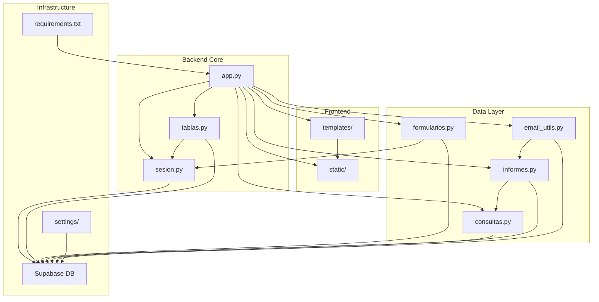

# 📋 Reporte de Documentación - Sistema de Gestión Flask con Supabase

## 1. **Resumen del Programa**

### **Objetivo principal:** 
Sistema de gestión integral para organizaciones religiosas que resuelve la necesidad de administrar predicadores, reuniones, calendario de eventos, control de asistencias, gestión de jóvenes, finanzas y generación de informes con auditoría completa.

### **Arquitectura:** 
Arquitectura **MVC (Model-View-Controller)** con separación clara de responsabilidades:
- **Modelo**: Operaciones CRUD en Supabase (PostgreSQL)
- **Vista**: Templates HTML con CSS/JS responsivo
- **Controlador**: Rutas Flask con validación y autenticación

### **Stack tecnológico:** 
- **Backend**: Flask 2.3.3 (Python)
- **Base de Datos**: Supabase (PostgreSQL)
- **Frontend**: HTML5, CSS3, JavaScript vanilla
- **Autenticación**: JWT + bcrypt
- **Despliegue**: Render (gunicorn)
- **Librerías clave**: supabase-py, flask-cors, flask-limiter, python-dotenv

---

## 2. **Documentación por Categorías**

### 🔧 **Core (Núcleo del Sistema)**

**Propósito:** Lógica de negocio principal, autenticación y gestión de sesiones.

#### `app.py` (ruta: `/app.py`)
- **Responsabilidad:** Aplicación principal Flask con todas las rutas API y configuración del servidor
- **Funciones clave:**
  - `index()`: Página principal del sistema
  - `api_login()`: Autenticación JWT con rate limiting (5/min)
  - `api_obtener_predicadores()`: CRUD predicadores
  - `api_generar_informe()`: Generación de informes dinámicos
- **Dependencias:**
  - Internas: `sesion.py`, `tablas.py`, `informes.py`, `email_utils.py`, `formularios.py`, `consultas.py`
  - Externas: `flask`, `flask-cors`, `flask-limiter`, `flask-jwt-extended`, `python-dotenv`
- **Uso en el flujo:** Punto de entrada principal, iniciado por gunicorn en producción

#### `sesion.py` (ruta: `/sesion.py`)
- **Responsabilidad:** Autenticación, autorización y gestión de usuarios con roles
- **Funciones clave:**
  - `hash_password(password)`: Genera hash bcrypt seguro
  - `is_admin(email, codigo, nombre)`: Verifica credenciales de administrador
  - `is_super_admin(user_email)`: Valida permisos de super administrador
  - `validar_datos(datos, esquema)`: Validación de datos según esquemas predefinidos
- **Dependencias:**
  - Internas: Ninguna
  - Externas: `supabase`, `bcrypt`, `flask.session`
- **Uso en el flujo:** Invocado por `app.py` en todas las rutas protegidas

#### `tablas.py` (ruta: `/tablas.py`)
- **Responsabilidad:** Operaciones CRUD para entidades principales (predicadores, reuniones, calendario)
- **Funciones clave:**
  - `buscar_predicadores_por_id(id)`: Consulta predicadores con filtro opcional
  - `obtener_ultima_id_y_registrar_predicadores(datos)`: Inserta y registra en historial
  - `editar_predicadores(datos)`: Actualiza con auditoría automática
  - `eliminar_predicadores(id)`: Soft delete con registro en historial
- **Dependencias:**
  - Internas: `sesion.py` (validación)
  - Externas: `supabase`, `flask.session`
- **Uso en el flujo:** Invocado por rutas API de `app.py` para gestión de tablas principales

### 📊 **Data Management (Gestión de Datos)**

**Propósito:** Operaciones CRUD para formularios y consultas avanzadas.

#### `formularios.py` (ruta: `/formularios.py`)
- **Responsabilidad:** Gestión de formularios (bandeja, asistencias, jóvenes, finanzas)
- **Funciones clave:**
  - `buscar_bandeja_por_id(id)`: Consulta tareas pendientes
  - `obtener_ultima_id_y_registrar_bandeja(datos)`: Crea tarea con metadatos
  - `procesar_tareas_pendientes()`: Actualiza estado de tareas automáticamente
  - `buscar_finanzas_por_id(id)`: Gestión de registros financieros
- **Dependencias:**
  - Internas: `sesion.py` (validación), `tablas.py` (historial)
  - Externas: `supabase`, `flask.session`
- **Uso en el flujo:** Invocado por rutas `/api/formularios/*` en `app.py`

#### `consultas.py` (ruta: `/consultas.py`)
- **Responsabilidad:** Consultas personalizadas, búsquedas avanzadas y auditoría
- **Funciones clave:**
  - `ver_historial(tabla, estado, usuario)`: Consulta historial con filtros
  - `consulta_personalizada(tabla, filtros, ordenamiento, limite)`: Consultas dinámicas
  - `buscar_por_texto(tabla, campo, texto)`: Búsqueda por texto libre
  - `consulta_con_relaciones(tabla_principal, relaciones)`: JOINs complejos
  - `exportar_consulta(tabla, filtros, formato)`: Exportación en múltiples formatos
- **Dependencias:**
  - Internas: Ninguna
  - Externas: `supabase`, `flask.session`
- **Uso en el flujo:** Invocado por rutas `/api/consultas/*` para búsquedas y auditoría

### 📈 **Reports & Analytics (Informes y Análisis)**

**Propósito:** Generación de informes, exportación y análisis de datos.

#### `informes.py` (ruta: `/informes.py`)
- **Responsabilidad:** Generación, gestión y exportación de informes
- **Funciones clave:**
  - `crear_informe(titulo, descripcion, consultas, formato)`: Crea nuevo informe
  - `generar_informe(id_informe)`: Ejecuta consultas y genera contenido
  - `generar_csv_informe(resultados)`: Exporta a formato CSV
  - `generar_informe_predicadores(filtros)`: Informe específico de predicadores
  - `generar_informe_finanzas(fecha_inicio, fecha_fin)`: Análisis financiero
- **Dependencias:**
  - Internas: `consultas.py` (consultas base)
  - Externas: `supabase`, `csv`, `json`, `io`
- **Uso en el flujo:** Invocado por rutas `/api/informes/*` para generación de reportes

### 📧 **Communication (Comunicación)**

**Propósito:** Envío de correos electrónicos y notificaciones.

#### `email_utils.py` (ruta: `/email_utils.py`)
- **Responsabilidad:** Envío de emails, notificaciones y compartición de informes
- **Funciones clave:**
  - `enviar_por_correo(datos)`: Envío de emails con HTML y adjuntos
  - `enviar_informe_por_correo(id_informe, destinatarios, asunto)`: Comparte informes
  - `enviar_notificacion(destinatarios, titulo, mensaje, tipo)`: Notificaciones del sistema
  - `verificar_configuracion_email()`: Valida configuración SMTP
- **Dependencias:**
  - Internas: `informes.py` (generación de contenido)
  - Externas: `smtplib`, `email.mime`, `ssl`
- **Uso en el flujo:** Invocado por rutas `/api/email/*` y automáticamente en informes

### 🎨 **Frontend (Interfaz de Usuario)**

**Propósito:** Presentación visual y interacción con el usuario.

#### `templates/base.html` (ruta: `/templates/base.html`)
- **Responsabilidad:** Template base con estructura HTML común
- **Funciones clave:**
  - Estructura HTML5 semántica
  - Loading overlay para UX
  - Modal para mensajes de error
  - Integración de CSS/JS dinámico
- **Dependencias:**
  - Internas: `static/css/main.css`
  - Externas: Ninguna
- **Uso en el flujo:** Heredado por todas las páginas del sistema

#### `static/css/main.css` (ruta: `/static/css/main.css`)
- **Responsabilidad:** Estilos CSS principales con diseño responsive
- **Funciones clave:**
  - Variables CSS para tema consistente
  - Grid layout para menú principal
  - Animaciones y transiciones
  - Media queries para responsive design
- **Dependencias:**
  - Internas: Ninguna
  - Externas: Ninguna
- **Uso en el flujo:** Aplicado automáticamente a todas las páginas

### ⚙️ **Configuration (Configuración)**

**Propósito:** Configuración de base de datos y despliegue.

#### `settings/supa_setup.sql` (ruta: `/settings/supa_setup.sql`)
- **Responsabilidad:** Script completo de configuración de Supabase
- **Funciones clave:**
  - Creación de todas las tablas del sistema
  - Configuración de índices para optimización
  - Triggers para auditoría automática
  - Políticas RLS (Row Level Security)
- **Dependencias:**
  - Internas: Ninguna
  - Externas: PostgreSQL/Supabase
- **Uso en el flujo:** Ejecutado una vez para configurar la base de datos

#### `requirements.txt` (ruta: `/requirements.txt`)
- **Responsabilidad:** Dependencias Python del proyecto
- **Funciones clave:**
  - Flask 2.3.3 y extensiones
  - Supabase client 2.0.2
  - Librerías de seguridad (bcrypt, JWT)
  - Gunicorn para producción
- **Dependencias:**
  - Internas: Ninguna
  - Externas: Todas las librerías listadas
- **Uso en el flujo:** Instalado por pip en desarrollo y Render en producción

---

## 3. **Diagrama de Relaciones**

---

## 4. **Características Técnicas Destacadas**

### 🔐 **Seguridad**
- Autenticación JWT con rate limiting
- Hashing bcrypt para contraseñas
- Row Level Security en Supabase
- Validación de datos en frontend y backend

### 📊 **Auditoría**
- Historial automático de todos los cambios
- Triggers PostgreSQL para auditoría
- Capacidad de revertir/restaurar cambios
- Trazabilidad completa de usuarios

### 🚀 **Performance**
- Índices optimizados en PostgreSQL
- Rate limiting para prevenir abuso
- CORS configurado para seguridad
- Gunicorn para producción

### 🎯 **UX/UI**
- Diseño responsive con CSS Grid
- Loading states y feedback visual
- Modales para confirmaciones
- Validación en tiempo real

---

## 5. **Estructura de Base de Datos**

### **Tablas Principales:**
- **`administradores`**: Usuarios del sistema con roles
- **`predicadores`**: Gestión de predicadores
- **`reuniones`**: Programación de reuniones
- **`calendario`**: Eventos y actividades
- **`bandeja`**: Tareas y objetivos
- **`asistencias`**: Control de participación
- **`jovenes`**: Base de datos de miembros
- **`finanzas`**: Control financiero
- **`historial_cambios`**: Auditoría completa
- **`informes`**: Reportes generados

### **Características de BD:**
- Triggers automáticos para auditoría
- Índices optimizados para consultas
- Políticas RLS para seguridad
- Relaciones entre tablas con claves foráneas

---

## 6. **API Endpoints Principales**

### **Autenticación:**
- `POST /api/sesion/login` - Login con JWT
- `POST /api/sesion/logout` - Cerrar sesión
- `GET /api/sesion/verificar` - Verificar sesión

### **Tablas Principales:**
- `GET/POST/PUT/DELETE /api/tablas/predicadores`
- `GET/POST/PUT/DELETE /api/tablas/reuniones`
- `GET/POST/PUT/DELETE /api/tablas/calendario`

### **Formularios:**
- `GET/POST/PUT/DELETE /api/formularios/bandeja`
- `GET/POST/PUT/DELETE /api/formularios/asistencias`
- `GET/POST/PUT/DELETE /api/formularios/jovenes`
- `GET/POST/PUT/DELETE /api/formularios/finanzas`

### **Consultas:**
- `GET /api/consultas/historial` - Auditoría
- `POST /api/consultas/personalizada` - Consultas dinámicas
- `POST /api/consultas/buscar` - Búsquedas por texto
- `POST /api/consultas/exportar` - Exportación

### **Informes:**
- `GET/POST/DELETE /api/informes` - Gestión de informes
- `POST /api/informes/generar` - Generación dinámica
- `POST /api/informes/descargar` - Descarga de reportes
- `POST /api/informes/compartir` - Compartición por email

---

## 7. **Flujo de Datos Típico**

1. **Autenticación**: Usuario se autentica via JWT
2. **Validación**: Sistema valida permisos y datos
3. **Operación CRUD**: Se ejecuta en Supabase
4. **Auditoría**: Trigger automático registra cambio
5. **Respuesta**: JSON con resultado y metadatos
6. **Frontend**: Actualización de UI con feedback

---

## 8. **Consideraciones de Despliegue**

### **Variables de Entorno Requeridas:**
- `SUPABASE_URL`: URL de proyecto Supabase
- `SUPABASE_KEY`: API key de Supabase
- `SECRET_KEY`: Clave secreta para Flask
- `JWT_SECRET_KEY`: Clave para JWT
- `GMAIL_PASS`: Contraseña para envío de emails

### **Configuración Render:**
- Build Command: `pip install -r requirements.txt`
- Start Command: `gunicorn app:app`
- Environment Variables: Configurar todas las variables requeridas

---

Este sistema representa una solución completa y robusta para la gestión de organizaciones religiosas, con arquitectura escalable y características de seguridad empresarial. 